# Media cascade detection framework

> **Note**: this framework is currently under active development. Features and APIs may change as we refine the detection algorithms and optimize performance.

A high-performance scientific framework for detecting information cascades in large-scale media corpora

## Overview

This repository implements the cascade detection component of the [Canadian Climate Framing (CCF) project](https://github.com/antoinelemor/CCF-canadian-climate-framing), analyzing climate change media coverage in Canada. The framework operates on the CCF database of 266,271 annotated articles from 20 major Canadian newspapers (1978-present) to detect media cascades—coordinated patterns of information diffusion across news outlets.

The cascade detector processes sentence-level annotations from the CCF pipeline, which extracts over 60 categories of information including frames, messengers, entities, and emotional tones. The framework employs exact computation methods to provide empirical evidence for multi-frame paradigm shifts in climate change media coverage.

Key features:
- **Exact network analysis**: full computation of all network metrics without sampling
- **Parallel processing**: optimized for Apple M4 Max architecture with 16 performance cores
- **Multi-layer detection**: simultaneous analysis across temporal, network, content, and social dimensions
- **Statistical validation**: multiple significance tests per cascade event

## Research objectives and innovation

### Core research question

How do climate change narratives cascade through Canadian media, and what mechanisms drive the emergence, propagation, and dominance of specific frames during critical periods?

This framework provides empirical tools to:
1. **Identify cascade triggers**: detect when and how specific events or actors initiate information cascades
2. **Trace propagation paths**: map how narratives spread from source to source across the media network
3. **Quantify frame dominance**: measure which climate frames gain traction and why
4. **Reveal coordination patterns**: uncover synchronized coverage across outlets that indicates cascade formation

### How the cascade detector works: from database to discovery

The framework implements a sophisticated pipeline that transforms raw article data into cascade discoveries:

```mermaid
flowchart TD
    DB[("<b>CCF DATABASE</b><br/>266,271 articles<br/><br/><i>Annotated with 60+ features:</i><br/>frames, entities, messengers,<br/>sentiment, locations, dates")]
    
    DB --> STEP1["<b>STEP 1: DATA LOADING & PROCESSING</b><br/><br/>• Extract time period from database<br/>• Clean and normalize sentence-level annotations<br/>• Convert dates, validate frames, parse entities<br/><br/><b>OUTPUT →</b> <i>Structured DataFrame ready for analysis</i>"]
    
    STEP1 --> STEP2["<b>STEP 2: PARALLEL INDEX CONSTRUCTION</b><br/><i>(multi-core processing)</i><br/><br/>• <b>Entity Index:</b> persons, organizations, locations extracted<br/>• <b>Source Index:</b> journalist and media outlet profiles<br/>• <b>Temporal Index:</b> multi-resolution time series per frame<br/>• <b>Geographic Index:</b> location mentions with spatial hierarchies<br/>• <b>Frame Index:</b> article-frame associations across 8 dimensions<br/>• <b>Emotion Index:</b> sentiment patterns and emotional arcs<br/><br/><b>OUTPUT →</b> <i>6 specialized indices optimized for cascade detection</i>"]
    
    STEP2 --> STEP3["<b>STEP 3: SIGNAL AGGREGATION</b><br/><i>(comprehensive feature extraction)</i><br/><br/>• Generate multiple time windows (3, 7, 14, 30 days × frames)<br/>• For each window, compute:<br/>  - <b>Volume metrics:</b> article count, growth rate, acceleration<br/>  - <b>Network metrics:</b> density, clustering, centrality<br/>  - <b>Content metrics:</b> frame alignment, semantic similarity<br/>  - <b>Authority metrics:</b> messenger concentration, source diversity<br/><br/><b>OUTPUT →</b> <i>High-dimensional feature matrix with cascade signals</i>"]
    
    STEP3 --> STEP4["<b>STEP 4: BURST DETECTION</b><br/><i>(multi-method validation)</i><br/><br/>• Apply 5 statistical methods:<br/>  - Kleinberg's burst detection for temporal anomalies<br/>  - Z-score for statistical significance<br/>  - Sliding window for local patterns<br/>  - Wavelet transform for multi-scale bursts<br/>  - Change point detection for regime shifts<br/><br/><b>OUTPUT →</b> <i>Candidate cascade events with confidence scores</i>"]
    
    STEP4 --> STEP5["<b>STEP 5: NETWORK ANALYSIS</b><br/><i>(exact computation with NetworKit)</i><br/><br/>• Build multi-layer article-entity-source networks<br/>• Compute EXACT betweenness centrality (accelerated algorithms)<br/>• Detect communities and influence paths<br/>• Identify bridge articles connecting frame clusters<br/><br/><b>OUTPUT →</b> <i>Network structure revealing cascade anatomy</i>"]
    
    STEP5 --> STEP6["<b>STEP 6: CASCADE VALIDATION & CLASSIFICATION</b><br/><br/>• Statistical validation (permutation tests, bootstrap CI)<br/>• Cross-media verification (≥3 outlets required)<br/>• Temporal coherence (sustained vs spike patterns)<br/>• Frame convergence analysis<br/><br/><b>OUTPUT →</b> <i>Validated cascades with type and strength</i>"]
    
    STEP6 --> STEP7["<b>STEP 7: PATTERN DETECTION & MECHANISM IDENTIFICATION</b><br/><br/>• Echo chamber detection (self-reinforcing loops)<br/>• Cross-media tracking (synchronized coverage)<br/>• Sequence detection (typical propagation signatures)<br/>• Polarization measurement (ideological clustering)<br/><br/><b>OUTPUT →</b> <i>Cascade mechanisms and propagation patterns</i>"]
    
    STEP7 --> DISCOVERIES["<b>RESEARCH DISCOVERIES</b><br/><br/>• <b>Cascade triggers:</b> e.g., IPCC report → 200% coverage spike<br/>• <b>Propagation paths:</b> national → regional in 24-48 hours<br/>• <b>Frame dominance shifts:</b> economic → environmental after event<br/>• <b>Media coordination:</b> 5+ outlets publish within 6 hours<br/>• <b>Paradigm shifts:</b> multi-frame cascade events"]
    
    %% Styling
    classDef database fill:#e8f5e9,stroke:#2e7d32,stroke-width:3px,color:#000
    classDef processing fill:#fff3e0,stroke:#f57c00,stroke-width:2px,color:#000
    classDef analysis fill:#e3f2fd,stroke:#1565c0,stroke-width:2px,color:#000
    classDef validation fill:#fce4ec,stroke:#c2185b,stroke-width:2px,color:#000
    classDef discovery fill:#f3e5f5,stroke:#6a1b9a,stroke-width:3px,color:#000
    
    class DB database
    class STEP1,STEP2 processing
    class STEP3,STEP4,STEP5 analysis
    class STEP6,STEP7 validation
    class DISCOVERIES discovery
```



**Potential cascade discovery example**: 
The framework could detect cascades such as those following the passing of the Greenhouse Gas Pollution Pricing Act in Summer 2018:
- **Trigger**: legislative milestone initiates widespread coverage
- **Initial response**: national outlets publish within hours of the announcement
- **Propagation**: regional outlets follow with localized angles within 24-48 hours
- **Peak**: high phrase similarity across outlets may indicate coordinated messaging or press release influence
- **Network**: key political figures could become central nodes connecting political and economic frames
- **Duration**: sustained multi-day or multi-week coverage patterns may emerge
- **Impact**: potential measurable shifts in frame dominance across the media landscape (e.g., from environmental to economic framing)

### Methodological innovations

#### 1. Exhaustive signal detection: capturing cascade emergence

Traditional approaches miss weak cascade signals by using arbitrary thresholds or sampling. Our framework captures ALL potential cascade indicators through:

**Signal aggregation (63+ features per time window)**
- **Temporal signatures**: detects acceleration patterns that distinguish organic growth from cascade behavior. For example, a sudden 300% increase in "economic frame" articles over 3 days following a carbon tax announcement
- **Network formation**: tracks how isolated coverage transforms into connected media networks. When multiple outlets start citing the same sources or entities, it signals cascade formation
- **Content alignment**: measures semantic convergence across outlets. High similarity in language and framing across different media indicates coordinated cascade behavior
- **Authority concentration**: identifies when specific "messengers" (scientists, politicians) suddenly dominate coverage, often triggering cascade events

#### 2. Exact network analysis: understanding cascade structure

Cascades have specific network signatures that approximations miss. Our framework computes EXACT metrics to identify these patterns:

**Multi-layer network construction**
- **Article layer**: how individual articles reference and build upon each other
- **Entity layer**: how persons, organizations, and locations become connected through coverage
- **Source layer**: how journalists and media outlets form influence networks
- **Cross-layer connections**: how entities become associated with specific frames and media outlets

**Critical metrics for cascade detection**
- **Betweenness centrality**: identifies "bridge" articles or sources that connect disparate parts of the network, often cascade catalysts
- **Community formation**: detects when previously independent coverage clusters merge, indicating cascade propagation
- **Eigenvector centrality**: reveals which nodes gain influence not just through connections but through connection to other influential nodes
- **Temporal evolution**: tracks how network metrics change over time to identify cascade phases (emergence, growth, peak, decay)

#### 3. High-performance computing: enabling real-time cascade tracking

Cascade detection requires analyzing millions of article pairs and computing exact metrics on graphs with thousands of nodes:

**Optimized parallel processing**
- **NetworKit integration**: uses C++ optimized algorithms that are 25-100x faster than pure Python for exact betweenness computation on large graphs
- **Intelligent task scheduling**: processes multiple time windows simultaneously, prioritizing smaller windows for rapid initial results while computing large windows in background
- **Memory-efficient indexing**: builds specialized indices that enable rapid lookup of article-entity-source relationships without loading entire dataset into memory
- **GPU acceleration**: leverages Apple M4 Neural Engine for matrix operations in similarity computations

## Architecture: from theory to implementation

### How cascade detection works

The framework implements a sophisticated pipeline that mirrors how cascades actually form in media ecosystems:

1. **Signal detection**: identifies anomalies in coverage patterns that may indicate cascade onset
2. **Pattern validation**: confirms that detected signals represent true cascades, not random fluctuations
3. **Network analysis**: maps the cascade structure to understand propagation mechanisms
4. **Quantification**: measures cascade intensity, reach, and impact

### Core detection modules (`cascade_detector/detectors/`)

These modules work together to identify different aspects of cascade behavior:

#### Cascade identification chain

**`burst_detector.py`** → **`signal_aggregator.py`** → **`cascade_detector.py`**

This three-stage pipeline mimics how cascades form in reality:
1. **Burst detection**: a triggering event causes sudden increase in coverage (e.g., IPCC report release causes 200% spike in climate articles)
2. **Signal aggregation**: multiple indicators converge (increased volume + frame alignment + source concentration = potential cascade)
3. **Cascade validation**: statistical tests confirm the pattern is non-random and represents true information cascade

#### Specialized pattern detectors

**`cross_media_tracker.py`**: detects synchronized coverage patterns
- *Research value*: reveals when multiple outlets coordinate coverage, indicating top-down cascade triggers (e.g., government announcements, PR campaigns)
- *Example*: detects when 5+ outlets publish similar carbon tax articles within 6 hours

**`echo_chamber_detector.py`**: identifies self-reinforcing coverage loops
- *Research value*: shows how cascades sustain themselves through circular referencing between outlets
- *Example*: toronto Star cites CBC, which cites Globe and Mail, which cites Toronto Star - creating artificial importance

**`sequence_detector.py`**: finds propagation patterns
- *Research value*: reveals typical cascade "signatures" - how information flows from national to regional media or from print to digital
- *Example*: pattern where national outlets break story → regional outlets follow within 24-48 hours → opinion pieces appear day 3-4

#### Indexing system (`cascade_detector/indexing/`)

The indexing system transforms raw article data into specialized data structures optimized for cascade detection:

**`index_manager.py`**: orchestrates parallel index construction
- *Research value*: enables processing of 266,271 articles in minutes rather than hours, making iterative research feasible
- *Technical approach*: distributes indexing tasks across 16 M4 Max cores, monitors memory usage to prevent swapping, dynamically adjusts worker allocation based on task complexity
- *Example*: processing January 2019 (8,500 articles) creates 6 parallel indices in ~45 seconds

**`entity_indexer.py`**: maps the "who" of cascades
- *Research value*: identifies key actors driving cascades - which politicians, scientists, or organizations trigger information spread
- *Authority scoring*: computes influence based on frequency (how often mentioned) and network position (who else mentions them)
- *Example*: during carbon tax debates, tracks how "Justin Trudeau" mentions spike from 50/day to 300/day, identifying him as cascade catalyst

**`source_indexer.py`**: profiles media behavior patterns
- *Research value*: reveals which journalists and outlets originate vs amplify cascades, exposing media influence hierarchies
- *Influence metrics*: tracks citation patterns, original reporting vs republishing, and cross-outlet references
- *Example*: identifies Globe and Mail as cascade originator for 40% of political frame cascades, with regional papers following 24-48 hours later

**`geographic_indexer.py`**: maps spatial cascade dynamics
- *Research value*: shows how climate narratives spread differently across Canada's diverse regions
- *Diffusion tracking*: measures cascade velocity from urban centers to rural areas, interprovincial spread patterns
- *Example*: carbon tax cascade starts in Ottawa media → spreads to Toronto in 6 hours → reaches Alberta papers in 24 hours with shifted framing

**`temporal_indexer.py`**: enables multi-scale temporal analysis
- *Research value*: detects cascades operating at different time scales - daily news cycles vs weekly narrative building vs monthly policy campaigns
- *Resolution adaptation*: automatically selects appropriate time granularity based on cascade characteristics
- *Example*: IPCC report triggers 3-day burst cascade, while pipeline debates show 30-day sustained cascade pattern

#### Metrics engine (`cascade_detector/metrics/`)

The metrics engine quantifies cascade behavior through exact computation of network and content metrics:

**`scientific_network_metrics.py`**: exact cascade structure analysis
- *Research value*: identifies the "backbone" of cascades - which articles/sources are critical bridges in information flow
- *NetworKit integration*: achieves 25-100x speedup for exact betweenness centrality using C++ optimized algorithms
- *Community detection*: reveals how independent coverage clusters merge during cascade formation
- *Example*: in pipeline debate cascade, identifies 3 key "bridge" articles that connected environmental and economic frame communities, transforming isolated coverage into unified cascade

**`exhaustive_metrics_calculator.py`**: comprehensive cascade quantification
- *Research value*: provides 100+ empirical measures to distinguish true cascades from random clustering
- *SIR simulation*: models cascade as epidemic spread to predict reach and duration
- *Percolation analysis*: identifies critical thresholds where local coverage becomes global cascade
- *Example*: correctly predicted that 2019 climate strike cascade would reach 80% of outlets within 72 hours based on initial 6-hour propagation pattern

**`parallel_signal_aggregator.py`**: intelligent computation scheduling
- *Research value*: enables real-time cascade detection during live events
- *Smart prioritization*: computes 3-day windows first (results in seconds) while processing monthly windows in background
- *Resource optimization*: allocates more cores to time-critical windows during breaking news events
- *Example*: during election night, provides cascade indicators every 15 minutes while computing comprehensive daily analysis in parallel

**`convergence_metrics.py`**: content alignment detection
- *Research value*: distinguishes coordinated messaging from organic coverage convergence
- *Semantic analysis*: measures vocabulary overlap, phrase repetition, and narrative structure similarity
- *Frame alignment*: tracks how different frames begin to co-occur as cascade develops
- *Example*: detected 89% phrase similarity across 12 outlets during government climate announcement, indicating coordinated press release cascade

**`diversity_metrics.py`**: echo chamber quantification
- *Research value*: measures cascade "health" - whether information flows freely or gets trapped in partisan bubbles
- *Polarization metrics*: quantifies ideological distance between outlet clusters
- *Shannon entropy*: tracks diversity collapse as cascade homogenizes coverage
- *Example*: carbon tax cascade showed 60% diversity reduction over 7 days as initial varied coverage converged to binary support/oppose framing

#### Optimization utilities (`cascade_detector/utils/`)

High-performance utilities that enable processing of massive media corpora:

**`parallel_entity_processor.py`**: massively parallel entity extraction
- *Research value*: enables tracking of thousands of actors across hundreds of thousands of articles in real-time
- *Performance breakthrough*: achieves 19,000+ articles/second using optimized chunking and shared memory transfer
- *Smart batching*: groups articles by length to minimize worker idle time, achieving 95% CPU utilization
- *Example*: processes entire 2019 corpus (100,000+ articles) entity extraction in under 6 seconds, enabling interactive cascade exploration

**`entity_resolver_fast.py`**: intelligent entity disambiguation
- *Research value*: ensures accurate cascade attribution by correctly identifying actors despite name variations
- *Disambiguation strategy*: uses context-aware matching - "Trudeau" in political articles → "Justin Trudeau", in historical context → "Pierre Trudeau"
- *Impact*: reduces entity duplication by 17%, preventing cascade fragmentation
- *Example*: correctly consolidates "PM Trudeau", "Justin Trudeau", "J. Trudeau", and "Prime Minister" (when contextually clear) into single entity for accurate influence tracking

**`location_resolver_fast.py`**: geographic standardization
- *Research value*: enables precise tracking of cascade geographic spread patterns
- *Hierarchical resolution*: maps locations to canonical forms while preserving geographic hierarchy (city → province → country)
- *Abbreviation handling*: resolves "TO" → "Toronto", "YYC" → "Calgary", "BC" → "British Columbia"
- *Example*: correctly identifies that coverage mentioning "Fort Mac", "Fort McMurray", and "Wood Buffalo" all refer to same oil sands region, revealing concentrated cascade origin

**`author_resolver.py`**: journalist identification and tracking
- *Research value*: reveals how individual journalists and their networks drive cascade formation
- *Name variation handling*: consolidates "John Smith", "J. Smith", "John Smith, Climate Reporter" into single profile
- *Cross-outlet tracking*: identifies when journalists move between outlets, maintaining influence continuity
- *Example*: tracked how senior climate reporter's move from Globe and Mail to CBC shifted cascade origination patterns between outlets

### Data flow

```
Raw Data (PostgreSQL)
    ↓
DataProcessor (cleaning, normalization)
    ↓
IndexManager (parallel index construction)
    ↓ [6 parallel indices]
SignalAggregator (feature extraction)
    ↓ [63+ features per window]
BurstDetector (multi-method detection)
    ↓
CascadeDetector (validation & scoring)
    ↓
NetworkMetrics (exact computation)
    ↓
Validated Cascades (with confidence scores)
```

## Performance characteristics

Benchmarked on Apple M4 Max (16 performance cores, 128GB RAM):

- **Throughput**: 1,500+ articles/second during indexing
- **Network analysis**: exact betweenness for 5,000 node graphs in <30 seconds
- **Parallel efficiency**: 30-40%
- **Memory usage**: <2GB per 100,000 articles
- **Cache performance**: 90%+ hit rate

## Usage

### Installation

```bash
# Clone repository
git clone https://github.com/antoine/CCF-media-cascade-detection.git
cd CCF-media-cascade-detection

# Create virtual environment
python -m venv .venv
source .venv/bin/activate

# Install dependencies
pip install -r requirements.txt
```

### Basic detection pipeline

```python
from cascade_detector.core.config import DetectorConfig
from cascade_detector.data import DatabaseConnector, DataProcessor
from cascade_detector.indexing import IndexManager
from cascade_detector.detectors import CascadeDetector

# Configuration
config = DetectorConfig(
    db_name="CCF",
    n_workers=16,  # M4 Max cores
    use_gpu=True,
    cache_size_gb=50
)

# Data loading and processing
connector = DatabaseConnector(config)
data = connector.get_frame_data(
    start_date="2019-01-01",
    end_date="2019-12-31"
)

processor = DataProcessor(config)
processed = processor.process_frame_data(data)

# Index construction (parallel)
index_manager = IndexManager(config)
indices = index_manager.build_all_indices(processed)

# Cascade detection
detector = CascadeDetector(indices, config)
cascades = detector.detect_cascades(
    window_sizes=[3, 7, 14, 30],
    frames=['Pol', 'Eco', 'Envt'],
    min_confidence=0.75
)

# Results
for cascade in cascades:
    print(f"Cascade detected: {cascade.start_date} - {cascade.end_date}")
    print(f"  Frame: {cascade.dominant_frame}")
    print(f"  Confidence: {cascade.confidence:.3f}")
    print(f"  Media involved: {len(cascade.media_involved)}")
    print(f"  Peak intensity: {cascade.peak_intensity:.2f}")
```

### Advanced analysis

```python
# Multi-frame cascade detection
from cascade_detector.detectors import MultiFrameDetector

multi_detector = MultiFrameDetector(indices, config)
multi_cascades = multi_detector.detect_paradigm_shifts(
    primary_frames=['Pol', 'Eco'],
    min_overlap=0.3,
    statistical_validation=True
)

# Network analysis
from cascade_detector.metrics import ScientificNetworkMetrics

network_metrics = ScientificNetworkMetrics(indices, config)
network_snapshot = network_metrics.compute_window_network(
    window=(datetime(2019, 1, 1), datetime(2019, 1, 31)),
    frame='Pol'
)

print(f"Network density: {network_snapshot.metrics['density']}")
print(f"Modularity: {network_snapshot.metrics['community']['modularity']}")
print(f"Top influencers: {network_snapshot.metrics['centrality']['pagerank']['top_nodes'][:5]}")
```

## Scientific validation

The framework includes the following validation mechanisms:

### Statistical tests
- Kolmogorov-Smirnov test for distribution changes
- Granger causality for temporal relationships
- Permutation tests for significance validation
- Bootstrap confidence intervals

### Robustness analysis
- Sensitivity analysis across parameter ranges
- Cross-validation with temporal splits
- Null model comparisons
- False positive rate estimation

## Database requirements

The system operates on the CCF annotated database with the following PostgreSQL schema:

```sql
Table: CCF_processed_data
├── doc_id              VARCHAR  -- Unique article identifier
├── sentence_id         INTEGER  -- Sentence number
├── date                VARCHAR  -- Date in MM-DD-YYYY format
├── media               VARCHAR  -- Media outlet name
├── author              VARCHAR  -- Journalist name
├── [Frame]_Detection   FLOAT    -- 8 frame columns (Cult, Eco, Envt, etc.)
├── Messenger_[1-9]_SUB VARCHAR  -- 9 messenger type columns
├── NER_entities        JSON     -- {"PER": [], "ORG": [], "LOC": []}
└── sentiment           FLOAT    -- Sentiment score [-1, 1]
```

## Next phase: multi-dimensional scoring system

The next phase of development (Phase 4) will implement a multi-dimensional scoring system to quantify and classify detected cascades across five core dimensions:

- **Temporal dimension**: velocity of spread, acceleration, burst intensity, and sustained duration
- **Network dimension**: centrality scores, propagation efficiency, clustering patterns, and reach
- **Content dimension**: frame convergence, narrative coherence, emotional resonance, and message clarity
- **Geographic dimension**: spatial spread, regional concentration, urban-rural balance, and cross-border diffusion
- **Authority dimension**: epistemic involvement, source credibility, and messenger influence

Each dimension will contribute 20% to the final cascade score, enabling classification into weak, moderate, or strong cascades based on empirical thresholds.
